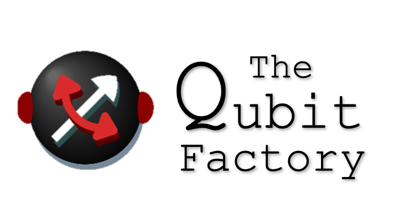
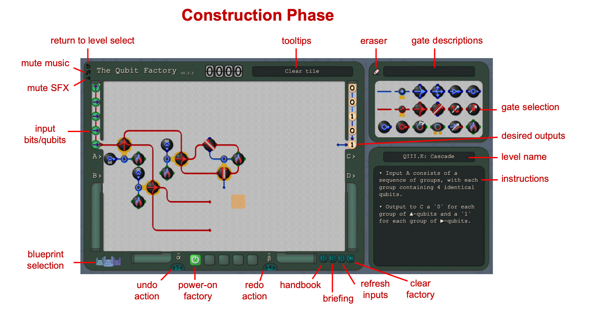
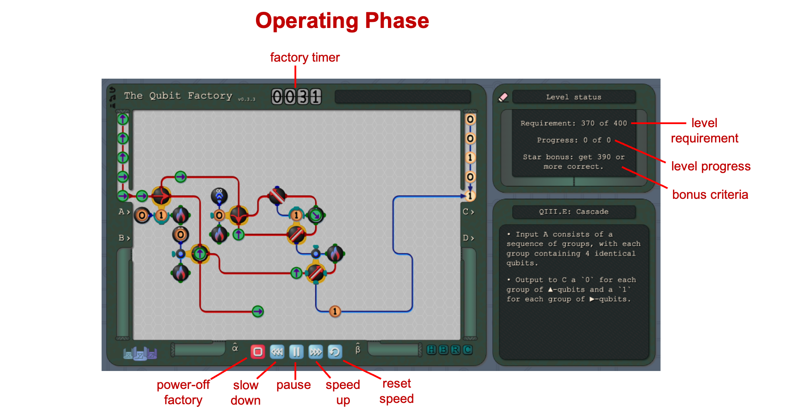
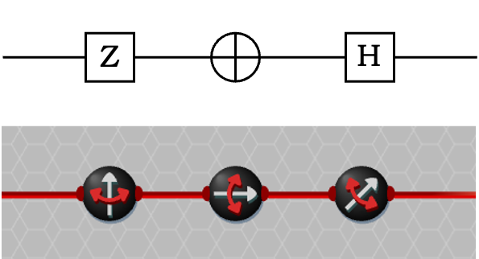
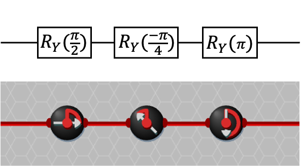
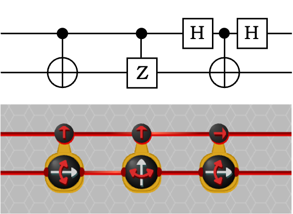
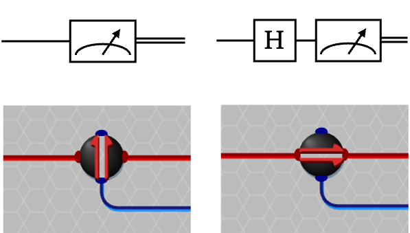
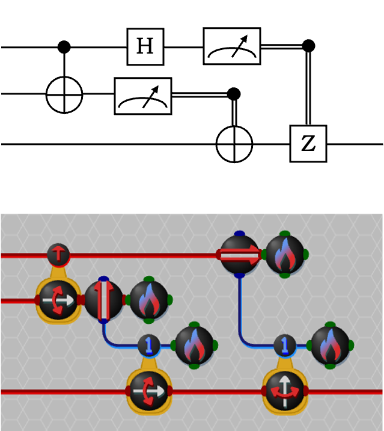

<figure style="height: 300px; margin: 10px; padding: 10px">

</figure>
 

A puzzle/construction game about manipulating **qubits** (quantum bits) to solve challenges involving quantum technology and computation. Play in your browser at [www.qubitfactory.io](https://www.qubitfactory.io/) or view the youtube [trailer](https://youtu.be/XAQ-XUk9InI).

## Troubleshooting: 

Encounter a bug or have suggestions for improvements? Either open an issue on the repo or email feedback@thequbitfactory.com.

If you encounter a crash then a solution could be to check that your browser is up-to-date (since _The Qubit Factory_ makes use of some Javascript features that may not be compatible with older browser versions). When reporting a crash it would be helpful if you could include the error message output to the browser console (usually accessed by `F12`). 

If you are experiencing low frame rates then please try switching to the 'simple graphics' setting from the options menu, which removes much of the gradient / transparency effects in order to improve performance (see also the FAQ).

## About: 
_The Qubit Factory_ is the culmination of a passion project to build a Zachtronics-style puzzle game about quantum computing. During the game users are challenged to construct circuits in order to manipulate **bits** and **qubits** (quantum bits) to find creative solutions to computational tasks, with an emphasis on distinguishing how qubits differ from the familiar bits used in regular computers. The game mechanics are based around authentic quantum theory, components, algorithms and protocols (many of which are vital to construction and utilization of present-day quantum devices), with the goal of allowing users to gain some (scientifically accurate!) understanding of quantum technology. _The Qubit Factory_ is intended to be a fun and engaging experience that is accessible to those without a prior background in quantum. However, towards the later levels, it will also to provide a **significant** challenge (and a useful educational resource) to quantum students throughout undergraduate, graduate and post-graduate educational levels.

## Controls:

The Qubit Factory can controlled via mouse/trackpad or in combination with keyboard. Below is an overview of the controls during **factory construction** (controls reference can also be accessed in-game by pressing `F1` or through the 'employee handbook'):
* Select, place, interact with objects: **LMB**.
* Erase objects:**RMB (or `E` key then LMB)**.
* Rotate gate (while placing): **Mouse-scroll (or ◀︎/▶︎ keys)**.
* Toggle control-gate states: **Double-click (or ALT/OPT-click)**.
* Copy gate(s): **SHIFT+LMB (+drag to select larger region)**.
* Cut gate(s): **CTRL/CMD+LMB (+drag to select larger region)**.
* Undo/redo last action: **`Z` or `Y` keys**.
* Select last/next available gate from menu: **`[` or `]` keys:**.
* Copy factory layout to clipboard: **CTRL+`C`**.
* Paste factory from clipboard: **CTRL+`V` (N/A for Firefox; see FAQ)** .

## Layout Reference: 
During gameplay, the user alternates between phases of constructing factories and then operating them. An overview of these UI interfaces is given below:
<figure style="width: 687px; height: 360px; margin: 10px; padding: 10px">

</figure>
 

During factory construction the main features that players interact with are:
* gate selection: for selecting object to place (alternative: `[` and `]` keys).
* eraser tool: for clearing gates and wires (alternative: Right-click or `E` key).
* blueprint selection: for storing/selecting different factory configs.
* undo/redo buttons (alternative: `Z` and `Y` keys).
* power-on factory: for beginning factory operation.

<figure style="width: 687px; height: 360px; margin: 10px; padding: 10px">

</figure>
 

During factory operation players mainly interact with the 5 bottom-center factory control buttons:
* power-off: reset the factory and return to construction phase.
* slow-down: reduce factory speed by 0.5x (switches to step-back if paused).
* pause / resume factory.
* speed-up: increase factory speed by 2x (switches to step-forward if paused).
* reset speed: return factory to default speed.

## Physics Restrictions: 
_The Qubit Factory_ provides accurate simulation of quantum/classical circuits (barring a few small exceptions). However, in order to strike a balance with maintaining accessibility, several restrictions were artificially imposed on the scope of allowed operations and calculations such that, although **accurate**, it is not a **complete** quantum circuit simulator (à la something like [Quirk](https://algassert.com/quirk)). For those familiar with quantum theory, these restrictions include:  
* allowing only real-valued states (i.e. no complex phases).
* allowing only pure states (i.e. no mixed states).
* allowing rotation/flip gates only to act at discrete angles in increments of π/8.
* allowing groups no larger than 6 qubits to be entangled together. Attempting to entangle larger groups will result in the some of the qubits spontaneously decohering.
* allowing superposition only between spin states of qubits (i.e. no superpositions of a qubit between different spatial locations).

However, despite these limitations, very many important quantum concepts, protocols and algorithms can still be accurately represented in _The Qubit Factory_ including quantum state tomography, quantum error correction, entanglement distillation, quantum repeaters, quantum teleportation, super-dense coding, the Bernstein–Vazirani algorithm and much more!

## Notation: 
_The Qubit Factory_ is intended to be accessible to users without prior knowledge of quantum circuits, thus it makes use of symbolic representations rather than standard technical circuit notation; here we provide a guide illustrating the connection between the two different representations for those already familiar with the latter. Note that the gates used in _The Qubit Factory_ are also explained in-game via the 'Employee Handbook'.

<dl>
<figure style="width: 700px; height: 163px; margin: 10px; padding: 10px; border: 1px solid #aaa">

<figcaption>Fig.1 - <strong>(Top)</strong> Circuit notation for Z Pauli, X Pauli and Hadamard gates.   <strong>(Bottom)</strong> Equivalent gates from <em>The Qubit Factory</em> are implemented via setting the `flip` gate along the appropriate axis.</figcaption>
</figure>
 

<figure style="width: 700px; height: 163px; margin: 10px; padding: 10px; border: 1px solid #aaa">

<figcaption>Fig.2 - <strong>(Top)</strong> Circuit notation for Y rotations through various angles.   <strong>(Bottom)</strong> Equivalent rotations in <em>The Qubit Factory</em> can be enacted via setting the 'rotation' gate to the appropriate angle.</figcaption>
</figure>
 

<figure style="width: 700px; height: 219px; margin: 10px; padding: 10px; border: 1px solid #aaa">

<figcaption>Fig.3 - <strong>(Top)</strong> Circuit notation for Controlled Not (CNOT), Controlled Z (CZ), and a CNOT sandwiched between Hadamard gates, such the the control is acting in the X-basis.   <strong>(Bottom)</strong> Equivalent controlled gates in <em>The Qubit Factory</em>. Notice the the basis in which the control acts can be set directly, thus avoiding the need for additional gates when the control does not act in the Z-basis. </figcaption>
</figure>
 

<figure style="width: 700px; height: 178px; margin: 10px; padding: 10px; border: 1px solid #aaa">

<figcaption>Fig.4 - <strong>(Top)</strong> Circuit notation for a Z-basis and X-basis (i.e. Hadamard then Z-basis) measurements. Both measurements produce as output a classical bit (double-line).   <strong>(Bottom)</strong> Equivalent measurements in <em>The Qubit Factory</em>, where the basis of the measurement corresponds to the orientation of the slit. Both a classical bit (blue) as well as the measured qubits are given as output. </figcaption>
</figure>
 

<figure style="width: 700px; height: 336px; margin: 10px; padding: 10px; border: 1px solid #aaa">

<figcaption>Fig.5 - <strong>(Top)</strong> Circuit notation for an implmentation of the quantum teleportation protocol.  <strong>(Bottom)</strong> An equivalent circuit in <em>The Qubit Factory</em>, which includes 'incinerators' (denoted by fire icons) that function to remove bits/qubits that are no longer needed. </figcaption>
</figure>
 
</dl>

## FAQ:
**How was _The Qubit Factory_ made? Did you use game-making software or some other framework?**
* Glen Evenbly: The game was written using vanilla javascript (and is my first significant project in javascript), and uses SVG-based graphics on the HTML5 canvas. In my job as a research scientist I otherwise usually program in Python or Julia.

**Why are Chrome/Edge/Brave/Opera suggested as the preferred browsers for QubitFactory? Why are Firefox/Safari not preferred?**
* The game was mostly developed/tested on Chrome, so Chrome (or other Chromium-based browsers) should offer the best experience. Limited testing was done on Firefox/Safari (and some browser specific compatibility issues were resolved) so QubitFactory should be, to our best knowledge, still fully functional on these other browsers. 
* A notable exception to the above is that Firebox is the only browser that does not allow `readText` from the clipboard, so methods to `CTRL-V` paste factories or saves from the clipboard do not work. A workaround is to paste directly into the developer console (F12 key). First create a variable defined by exactly pasting the clipboard data that you are trying to import: `var clipText = <your-pasted-text>`. Then import manually either a single factory from **within a level** as:

      Helper.tryImportLayout(JSON.stringify(clipText))

   or an entire save profile from **the level select** as: 

      Helper.importSave(clipText)
* QubitFactory appears to be more performant on Chromium (steadily maintaining 120fps on macbook or windows laptop/desktop), while giving lower fps when using Firefox/Safari on the same hardware. The reasons for this are not obvious, but some limited benchmarking revealed that certain operations involving the HTML5 canvas were more than 100x slower on Firefox/Safari than on Chromium. Switching to the 'simple' graphics mode in the options menu (which removes much of the gradients/shadows/transparencies) can boost performance if this is an issue. 
* Glen Evenbly: While trying to get things to work properly on Safari the **"Why can't you just be normal!"** meme sprung to mind more than once. 

**What inspired the development of _The Qubit Factory_?**
* Glen Evenbly: One of my favorite PC games from childhood was _The Incredible Machine_, a 1993 puzzle game about building Rube-Goldberg style machines in order to solve various tasks. Since then, this genre of game has seen quite a modern resurgence due to awesome developers like _Zachtronics_. The aspect of these games that I personally enjoy most is, given a small set of tools and components, in finding a creative solution to an open-ended task (which is also why I enjoy being a research scientist!). So for a while I had been considering making my own version of such a game, and basing the game on quantum computation was a natural choice for me (and is a topic that I am eager about promoting). Also, having taught quantum mechanics at both college undergraduate and graduate-level, I was motivated to try to build a tool that could help facilitate a more intuitive understanding of this otherwise very counter-intuitive topic; one that I would have found useful while teaching. 

**A common feature in Zachtronics games is, upon completion of a level, to present players with statistics comparing their solution against the aggregate of other players solutions (e.g. in terms of time taken or total space used). Could a similar feature be implemented in QubitFactory?**
* This feature, while certainly desirable, adds many additional complications such that it is unlikely to be implemented. Currently QubitFactory is only client-side javascript; implementing this feature would require a server-side component to collect and aggregate data (as well the code to communicate with said server).

**Do you have other recommendations for quantum-inspired games?**
*  The [Quantum Flytrap](https://quantumflytrap.com/) is an interesting puzzle game based on an accurate realization of quantum optics. Many other quantum games and activities can be found [here](https://q12education.org/quantime).

**Where did you get the music for the game?**
* The music is courtesy of Eric Matyas at [Soundimage.org](https://soundimage.org/).

**Where did you get the graphics for the game?**
* Most of the graphics were made from scratch using SVG paths, but some of the background textures are from [SVGbackgrounds.com](https://www.svgbackgrounds.com/).

## Disclaimer: 
_The Qubit Factory_ is set within a fictional reality about robots doing robotty things in a robot factory. The character dialog contained within, written wholly by developer Glen Evenbly, is intended to be humorous and satirical. The opinions, views and practices of characters from within _The Qubit Factory_ do not reflect those of the developers or the developers' employer. 

## License:
_The Qubit Factory_ is licensed under Apache 2.0.